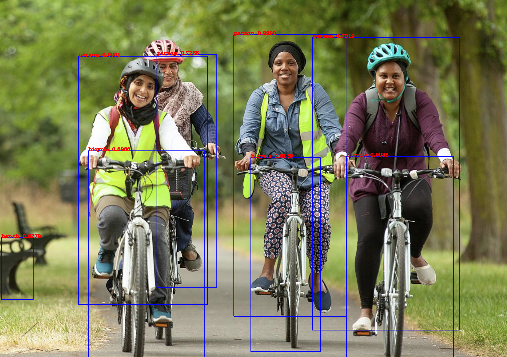
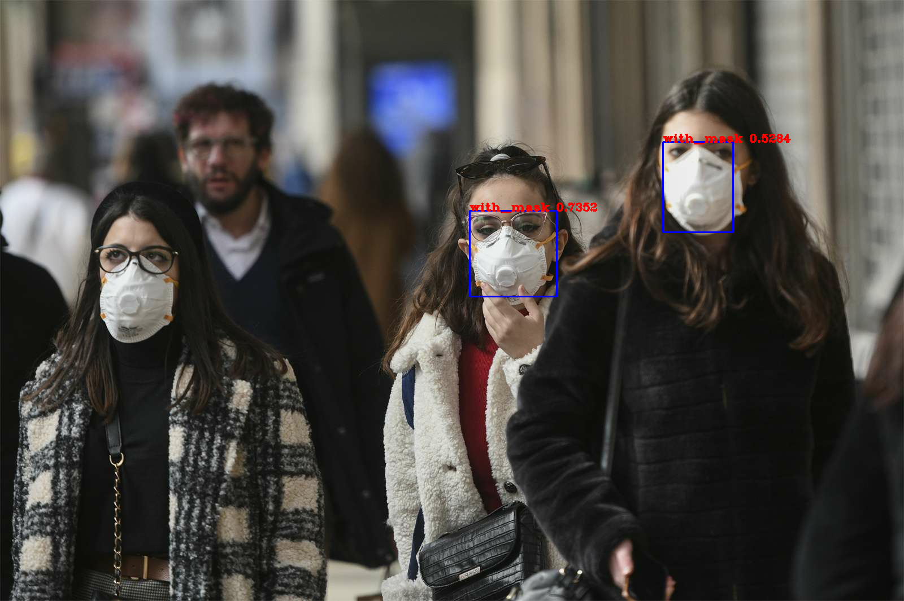

# Yolov3-Object-Detection

This model was created with help from various sources on the internet. Took a couple month to completely finish this repo and the main reason is because I want to fully understand about the inner working of this model, so even though I could find some premade functions or codes, I'd make sure I understand evey bit of the code and try to type the code myself.

The model is based on the original Yolov3 paper. The pretrained weights can be downloaded using this [Link](https://pjreddie.com/media/files/yolov3.weights).

Here is an example on what the model is capable of

To top it all up, I also created and trained a custom model using new dataset. I downloaded the dataset from this [link](https://www.kaggle.com/andrewmvd/face-mask-detection) on Kaggle. This dataset contains 3 type of classes:
- with mask
- without mask
- mask worn incorrectly

Here is an example of detection using the newly trained custom model with the new dataset

The new custom model may appear to perform rather poorly, which make sense due to the lack of GPU power and data. But the main point of training the custom model is to show that the program can perfectly work and train the model.
